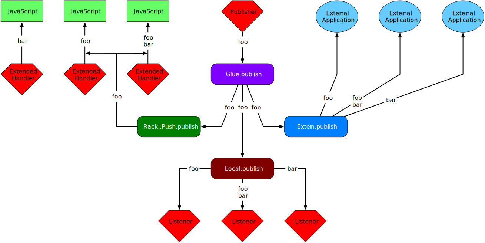

# Glue

The publish and subscribe model can be used in several different ways. It can
be used as a process integration tool where a Ruby object publishes to
external application using something Redis or NATS. It can also be used as
means for Ruby object to exchange data using subject or channel based
addressing. It can also be used to push data to external listeners over a
WebSocket or SSE connection.

If there is a desire to merge all three into one API then a glue component can
be introduced that distributes messages across all three (or more)
systems. The glue component could also be used to bridge publish servers so
that a message received on the Extern.publish (represents a server) could then
be bridge to both the Local.publish and Rack::Push.publish servers.

The use of a glue component allows each of the three servers to be written
completely independently. It also allows different implemenations of each to
be used if the developer wish to change any of the servers.

The diagram shows publishing from a Ruby object to a listener through a
server. In each case the reverse is also possible except for an SSE
connection.

